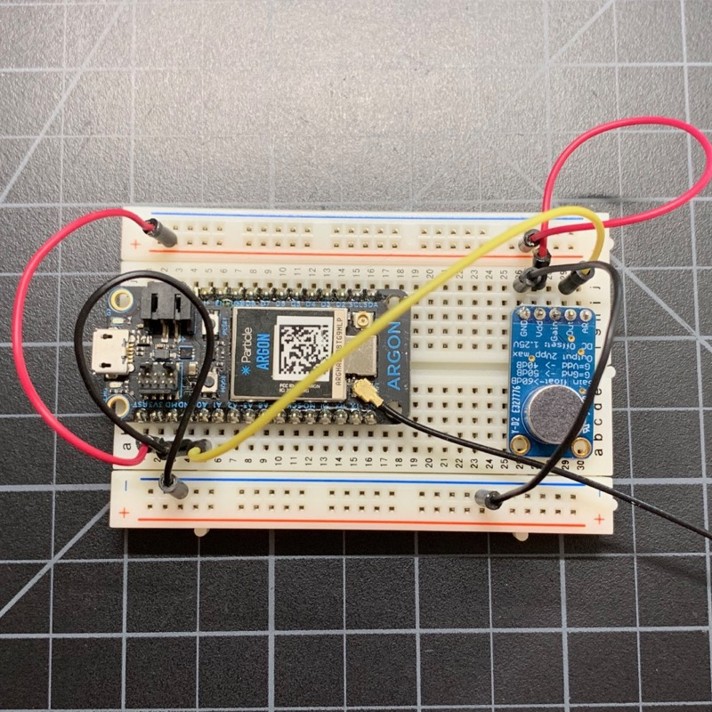
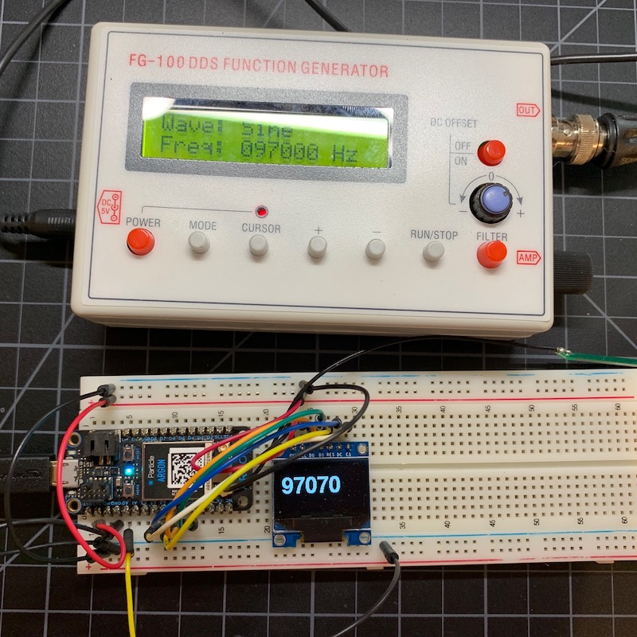

# ADC DMA Gen3

*Analog to digital conversion using DMA for Particle Gen 3 devices (Argon, Boron, Xenon)*

**Note: This feature is experimental and not supported. It may not work properly. It may break in a future version of Device OS. Beware!**

Also, this is the preview release 0.0.1, there may still be bugs.

## Introduction

Normally, on Particle (and Arduino) devices, the `analogRead()` function reads a value from a pin synchronously. There's a limit to how fast you can do this, and also because of the task scheduling on Particle, it's hard to do this regularly.

The nRF52 MCU in the Particle Argon, Boron, and Xenon has the ability to sample the analog to digital converter (ADC) using DMA (direct memory access). This samples the ADC at precise intervals (even when interrupts are disabled) and stores the values in RAM. You can do this into a single buffer if doing a one-shot sample until the buffer is filled. Or you can use double buffers so the capture is continuous. Once one buffer is filled you can begin processing it while the other buffer continues to be filled.

Some caveats:

- This is an unsupported feature.
- You cannot mix calls to ADC DMA and `analogRead()` at the same time. In order to `analogRead()` you must `uninit()` the ADC DMA.
- There are hardware timer limitations. In the examples below, NFC cannot be used at the same time as ADC DMA, but if you absolutely need to use NFC you could give up a different peripheral (like Serial1).

You typically create a `ADCDMAGen3` object as a global variable. You can only have one per app!

```
#include "ADCDMAGen3_RK.h"

ADCDMAGen3 adc;

const size_t SAMPLE_FREQ = 16000; // Hz

const size_t SAMPLES_IN_BUFFER = 1024;

static nrf_saadc_value_t buffer0[SAMPLES_IN_BUFFER];
static nrf_saadc_value_t buffer1[SAMPLES_IN_BUFFER];

```

Some constants and two buffers are set up as global variables as well.

You can either set up the settings from `setup()` or right before you need to use ADC DMA. 

```
	ret_code_t err = adc
		.withSampleFreqHz(SAMPLE_FREQ)
		.withDoubleBuffer(SAMPLES_IN_BUFFER, buffer0, buffer1)
		.withSamplePin(A0)
		.withBufferCallback(myBufferCallback)
		.init();
```

Settings are made fluent-style with the `withXXX()` methods. In the example above:

- Sampling frequency is set to `SAMPLE_FREQ` (16000 Hz)
- Double buffering is enabled and stores `SAMPLES_IN_BUFFER` (1024) samples in each of `buffer0` and `buffer1`. When one buffer is filled the bufferCallback is called and the other buffer will continue to be filled. This prevents losing samples while processing a buffer.
- Samples pin A0
- Sets the bufferCallback to the function `myBufferCallback`.
- Finally calls `init()` to complete the initialization.

You must call `init()` and `start()` to actually start sampling. 

You can call `init()` once and use `start()` and `stop()` as necessary.

Or you can call `init()` and `start()` whenever you want to sample and call `uninit()` when done. This will release the ADC resources when not actively being used.

If you want to mix ADC DMA and `analogRead()` you need to call both `uninit()` and `restoreDefaults()`. See the 07-mixed example for more information.

The other thing you need to do is set a bufferCallback, the function that's called when a 

The bufferCallback function looks like this:

```
void myBufferCallback(nrf_saadc_value_t *buf, size_t size) {
	// This gets executed after each sample buffer has been read.
	// Note: This is executed in interrupt context, so beware of what you do here!

	// We just remember the buffer and handle it from loop
	bufferReady = buf;
}
```

Because we may want to do lengthy operations we just save the buffer pointer and handle it from loop().

The samples other than 01-simple use a C++11 lambda to handle the buffer callback. That technique can also be used to call a class member function if desired.

```
	adc.withBufferCallback([](nrf_saadc_value_t *buf, size_t size) {
		// This gets executed after each sample buffer has been read.
		// Note: This is executed in interrupt context, so beware of what you do here!

		// We just remember the buffer and handle it from loop
		bufferReady = buf;
	});
```

In addition to the SAADC (successive approximation ADC) module in the nRF52, this library also requires a hardware timer. Unfortunately there are no free timers available and you'll have to steal one.

- 0: Softdevice - do not use
- 1: Radio - probably best to not use, might work if not using BLE or mesh
- 2: Usart (Serial1) Can use if not using Serial1.
- 3: Usart (Serial2 on Xenon) Cannot be used on Argon or Boron because it's required by NCP.
- 4: NFC - recommended (unless you need NFC). This is the default.

The default is to use the NFC timer, which means you can't use NFC at the same time. If you need NFC, then you can switch to using a different timer using `withHardwareTimer()`.


## API documentation

The full API documentation can be found [here](https://rickkas7.github.io/ADCDMAGen3_RK/index.html).

## Examples

### 01-simple

This is the simplest example, and the code is described above in the introduction.

### 02-audio-over-tcp

This sends audio data to a node.js server (located in the server directory).

I used an [Adafruit 1713](https://www.adafruit.com/products/1713) Electret Microphone Amplifier - MAX9814 with Auto Gain Control. Connect:

- GND to GND
- Vd to 3V3
- Gain (leave unconnected)
- Out to A0
- AR (leave unconnected)


 
Make sure you update the example code with the IP address and port of your server.

To install the dependencies:

```
cd server
npm install
```

To run the server:

```
npm start
```

To sample audio, tap the MODE button. It will connect to the server and send audio for 30 seconds, or until you stop it using the MODE button.

The server saves .wav files in the `out` directory.

### 03-one-shot-freq-counter

This code samples A0 to find the dominant frequency. This is best tested by connecting a function generator to A0. Make sure it's set to a sine wave 0 to 3.3V, not sending negative voltages!

This samples at 200 kHz so it can detect frequencies up to a little less than 100 kHz.

The frequency is printed to USB debug serial. You can read it with a serial terminal program or `particle serial monitor`.

### 04-continuous-freq-counter

This is a continuous version the frequency counter. When the frequency changes it's printed to the USB debug serial. It's limited to detecting frequencies up to around 24 kHz.

### 05-dtmf

This example listens to the microphone input on A0 and prints any DTMF (telephone keypad) frequencies it hears to USB debug serial.

### 06-dtmf-two-channel

This example shows how to handle sampling multiple pins using the DTMF decoder. 

### 07-mixed

This example shows how to switch between ADC DMA and `analogRead()` mode. Basically, make sure you call:

```
adc.uninit();
adc.restoreDefaults();
```

after using ADC DMA and before using `analogRead()` again. Then call `adc.init()` again if you want to use ADC DMA again. You don't need to reset the settings using the `withXXX()` methods again; they are saved.

## More Examples

The more-examples directory contains more examples, mainly based on the SSD1306 display.

### more-examples/01-dtmf-display

Works like the 05-dtmf example, but displays the results on a 0.96" OLED SSD1306 display.

<video width="640" height="360" controls >
  <source src="images/dtmf.mp4" type="video/mp4">
</video>

### more-examples/02-spectrum 

Based on the 04-continuous-freq-counter example, instead of picking the dominant frequency it displays the results on a SSD1306 display showing the amplitude on each frequency bucket.

I'm not completely sure the results are correct, however it does display something, and does update at 20 millisecond intervals, which is pretty impressive, in my opinion.

### more-examples/03-frequency-counter

A slightly modified version of 04-continuous-freq-counter that samples at 200 kHz and displays the results on a SSD1306 display.

It's pretty close (97000 vs. 97070 Hz.)!



## Version History

- 0.0.1 (2019-09-27) Initial version. There may be bugs still.


